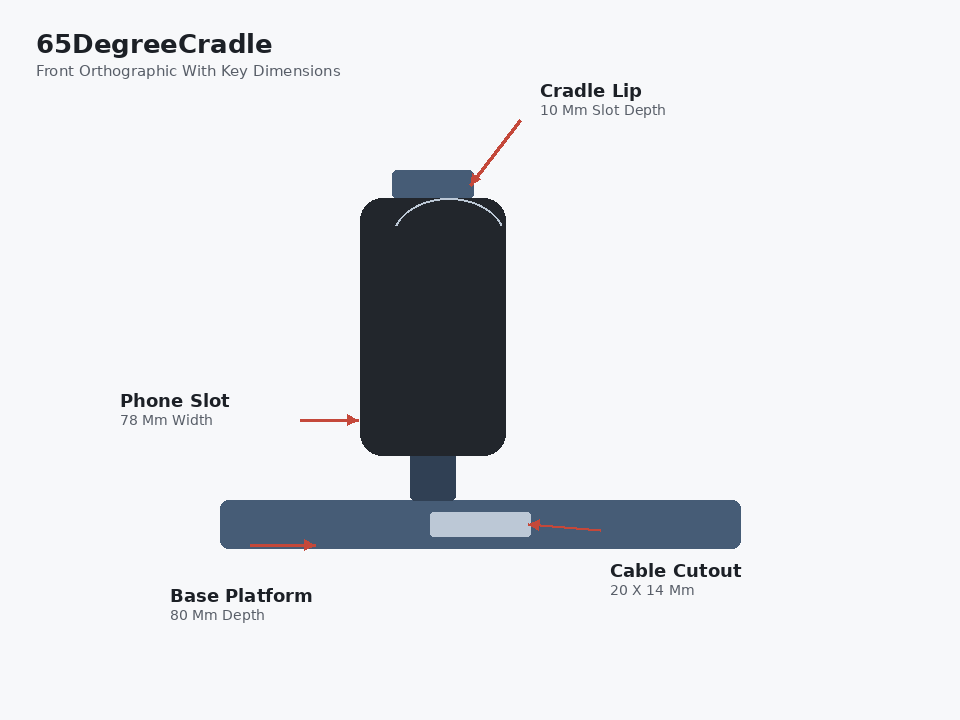
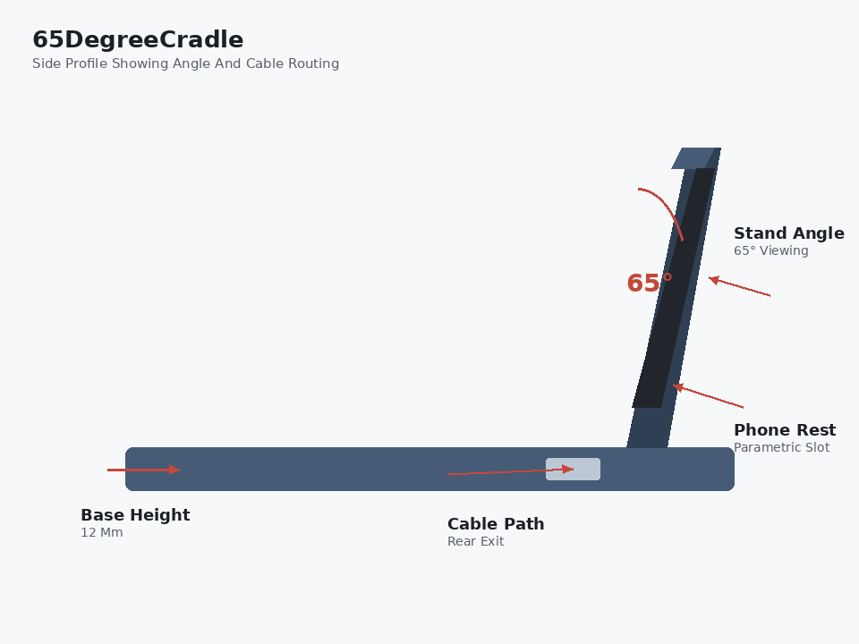
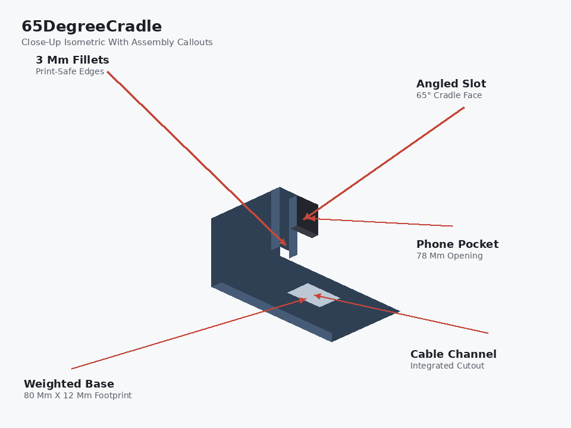

# 65DegreeCradle

## Overview

65DegreeCradle is a single-part parametric phone cradle designed in Onshape for desk use and FDM 3D printing. The geometry holds a phone at a fixed 65° viewing angle, routes a charging cable through the base, and keeps every major dimension tied to named variables so the design can be resized without rebuilding features manually.

The part was built around three engineering priorities: stable support under phone weight, usable cable routing during charging, and printable geometry with filleted edges and consistent wall thickness.

## Features

- Fixed 65° viewing angle for comfortable screen visibility
- Integrated cable cutout at the base for charging while seated
- Wide, weighted base for stability during use
- Filletted edges and printable wall thickness suitable for FDM output
- Fully parametric variable table for rapid design iteration

## Technical Specifications

| Parameter | Value | Description |
|-----------|-------|-------------|
| phone_width | 78 mm | Width of phone slot |
| phone_depth | 10 mm | Depth of phone slot |
| stand_angle | 65 deg | Cradle viewing angle |
| base_depth | 80 mm | Front to back depth of base |
| base_height | 12 mm | Height of base platform |
| fillet_radius | 3 mm | Edge fillet radius |
| cable_cutout_width | 20 mm | Width of cable cutout |
| cable_cutout_height | 14 mm | Height of cable cutout |

Full parameter notes are documented in [docs/parameters.md](docs/parameters.md).

## Engineering Notes

- **Parametric structure:** Slot width, stand angle, base depth, and fillet radius are stored as Onshape variables, so design changes propagate through extrudes, cuts, and edge treatments automatically.
- **Constraint-driven sketching:** The base profile and slot geometry were fully defined before feature creation to avoid downstream rebuild errors.
- **Functional cutout sizing:** The cable channel was sized at 20 x 14 mm to pass a standard charging connector without binding against the base wall.
- **Print-oriented detailing:** 3 mm fillets were applied to external edges to improve FDM surface quality and reduce stress concentration at sharp corners.
- **Stability geometry:** The 80 mm base depth and 12 mm platform height were selected to lower the center of support and resist tipping when a phone is inserted.

## Design Workflow

1. Base profile sketched and fully constrained on the front plane
2. Base platform extruded to establish the support footprint
3. Phone slot cut on the angled cradle face
4. Cable routing cutout added to the rear of the base
5. Chamfers and fillets applied for usability and print quality
6. Dimensions reviewed against target phone geometry and print constraints

## Project Takeaways

- Parametric CAD is most reliable when sketches are fully constrained before moving into 3D features.
- Small dimensional changes, such as slot depth or cutout width, have an outsized effect on usability and should be tested early.
- Fillets and chamfers need to be planned around interior corners, since tight geometry can cause feature failures until the underlying edges are prepared.
- Building a complete part end to end, from sketch to exportable mesh, is an effective way to connect CAD theory with practical design decisions.

## Renders

## Tools

- **Onshape** for parametric part modeling and export

## Files

| File | Description |
|------|-------------|
| [onshape_link.txt](onshape_link.txt) | Link to the Onshape document |
| [exports/65DegreeCradle.stl](exports/65DegreeCradle.stl) | Exported mesh for 3D printing |
